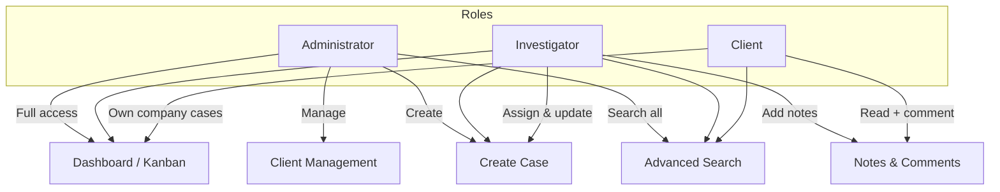
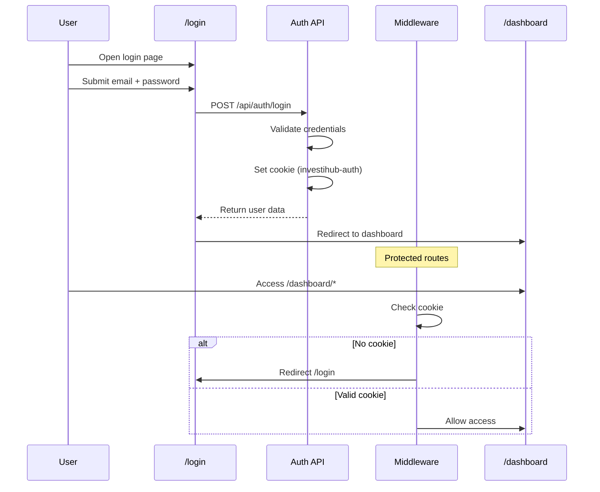
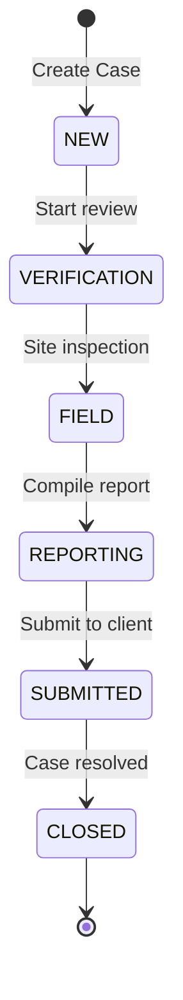
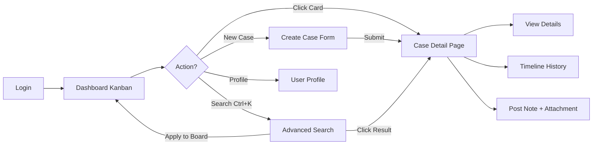
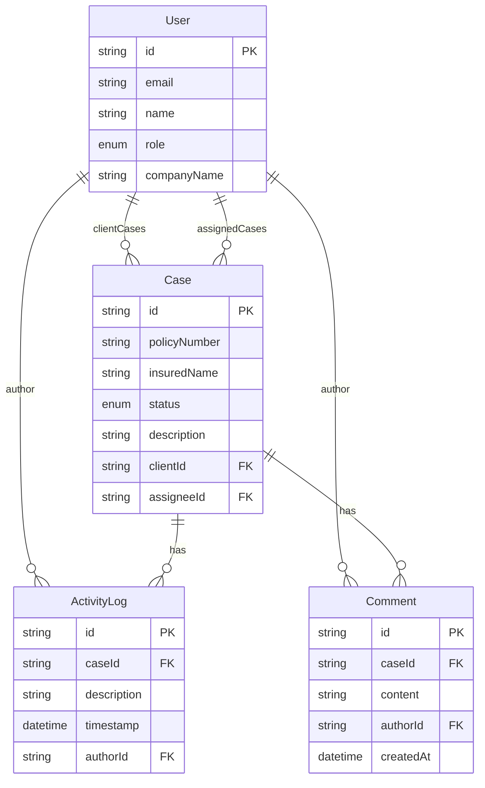
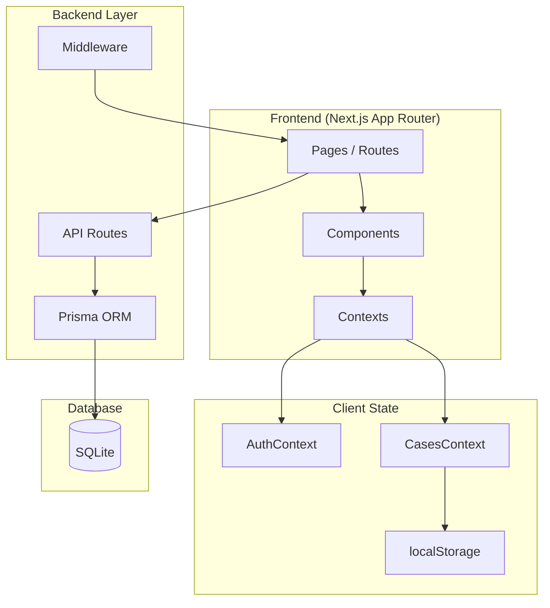

# InvestiHub — Documentation

> **Insurance Claim Case Management System**  
> Dokumentasi flow & detail fungsi untuk presentasi

---

## 1. Executive Summary

**InvestiHub** adalah aplikasi web untuk manajemen klaim asuransi (Case Management System). Platform ini menghubungkan tiga peran utama — **Admin**, **Investigator**, dan **Client** (perusahaan asuransi) — dalam satu workflow terpusat untuk melacak, menangani, dan menutup klaim asuransi. Pemegang polis (`insuredName`) hanya muncul sebagai data kasus yang diinvestigasi, bukan sebagai user platform.

### Value Proposition

| Aspek | Manfaat |
|-------|---------|
| **Visibility** | Status klaim terlihat real-time via Kanban Board |
| **Collaboration** | Notes & comments dengan rich text + attachment |
| **Efficiency** | Advanced search unified + filter ke board |
| **Traceability** | Timeline history per case |
| **Role-based Access** | Setiap role hanya melihat & melakukan aksi yang relevan |

---

## 2. Tech Stack

| Layer | Technology |
|-------|------------|
| Framework | Next.js 15 (App Router) |
| Language | TypeScript |
| Styling | Tailwind CSS v4 |
| UI Components | ShadcnUI + Radix UI |
| Icons | Lucide React |
| Animation | Framer Motion |
| ORM / Database | Prisma + SQLite |
| Validation | Zod |
| Auth | Cookie-based session (simulated) |

**Dev URL:** `http://localhost:3030`

---

## 3. User Roles & Permissions



### Permission Matrix

| Feature | Admin | Investigator | Client |
|---------|:-----:|:------------:|:------:|
| Kanban Board (all cases) | ✅ | ✅ | ⚠️ Own company only |
| Create Case | ✅ | ✅ | ❌ |
| Assign Investigator | ✅ | ✅ | ❌ |
| Set Initial Status | ✅ | ✅ | ❌ |
| Case Detail / Timeline | ✅ | ✅ | ✅ (read) |
| Post Notes & Comments | ✅ | ✅ | ✅ |
| Attachment (img/video/file) | ✅ | ✅ | ✅ |
| Advanced Search | ✅ | ✅ | ✅ |
| Client Management | ✅ | ❌ | ❌ |
| User Profile | ✅ | ✅ | ✅ |

---

## 4. Demo Accounts

| Role | Email | Password | Notes |
|------|-------|----------|-------|
| Investigator | `investigator@investihub.com` | `password123` | Login: `/login` |
| Client | `client@investihub.com` | `password123` | Rina Kusuma · PT Asuransi Sejahtera · `/login` |
| Client (Allianz) | `client@allianz.co.id` | `password123` | Allianz portal · `/login/allianz` |
| Client (Prudential) | `client@prudential.co.id` | `password123` | Prudential portal · `/login/prudential` |
| Admin | `admin@investihub.com` | `password123` | Login: `/login` |

### Client Portals

| Portal | URL | Theme |
|--------|-----|-------|
| InvestiHub (default) | `/login` | Red / black |
| Allianz exclusive | `/login/allianz` | Corporate blue + Allianz logo |
| Prudential exclusive | `/login/prudential` | Logo red (#E81828) + gray (#687078) + Prudential logo |

---

## 5. Application Flow

### 5.1 Authentication Flow



**Route Protection:**
- `/dashboard/*` → wajib login
- `/login`, `/register` → redirect ke dashboard jika sudah login
- Middleware file: `src/middleware.ts`

---

### 5.2 Case Lifecycle Flow



| Status | Deskripsi |
|--------|-----------|
| **NEW** | Klaim baru masuk sistem |
| **VERIFICATION** | Dokumen & data sedang diverifikasi |
| **FIELD** | Investigasi lapangan |
| **REPORTING** | Penyusunan laporan |
| **SUBMITTED** | Laporan diserahkan ke client |
| **CLOSED** | Klaim selesai / ditutup |

---

### 5.3 End-to-End User Journey



---

## 6. Feature Details

### 6.1 Dashboard — Kanban Board

**Route:** `/dashboard`

**Fungsi:**
- Menampilkan semua case dalam 6 kolom status
- Layout responsif:
  - Mobile: horizontal scroll (1 kolom)
  - Tablet: 2 kolom grid
  - Desktop: 3–6 kolom grid
- Setiap **Case Card** menampilkan:
  - Policy Number
  - Insured Name (nama nasabah)
  - Insurance Company
  - Assignee (penanggung jawab)
  - Status badge (warna merah per status)
- Klik card → navigasi ke halaman detail case

**Filter aktif:**
- URL query params dari Advanced Search (`?q=...&status=...`)
- Filter chips dapat dihapus per item

---

### 6.2 Create Case

**Route:** `/dashboard/cases/new`

**Form Fields:**

| Field | Type | Required | Notes |
|-------|------|:--------:|-------|
| Policy Number | Text | ✅ | Min 3 karakter |
| Insured Name | Text | ✅ | Min 2 karakter |
| Insurance Client | Select | ✅ | Auto untuk Client role |
| Assignee | Select | ❌ | Admin & Investigator only |
| Initial Status | Select | ❌ | Default: NEW |
| Description | Textarea | ❌ | Max 1000 karakter |

**Validasi:** Zod schema (`src/lib/validations/case.ts`)

**Setelah submit:**
- Case disimpan ke localStorage (demo mode)
- Redirect ke `/dashboard/cases/[id]`
- Muncul di Kanban Board kolom status yang sesuai

---

### 6.3 Case Detail Page

**Route:** `/dashboard/cases/[id]`

**Sections:**

#### A. Case Details
Informasi lengkap: insured name, insurance company, assignee, status, created date, last updated, description.

#### B. Timeline History
Vertical timeline dengan event-event:
- Case created
- Documents uploaded
- Assigned to investigator
- Field visit scheduled
- *(dan seterusnya)*

#### C. Notes & Comments
- **Rich Text Editor** — bold, italic, underline, heading, list, quote, link
- **Attachment support:**
  - Image (JPG, PNG, WebP, HEIC, dll.)
  - Video (MP4, WebM, MOV)
  - File (PDF, DOC, XLS, TXT, ZIP)
  - Drag & drop upload
  - Preview sebelum post
- Client & Investigator dapat menambah note
- Attachment disimpan sebagai base64 (demo mode)

---

### 6.4 Advanced Search

**Trigger:** Search bar di header / icon mobile / shortcut `Ctrl + K`

**Unified Form — satu panel untuk semua pencarian:**

| Filter | Fungsi |
|--------|--------|
| Search query | Policy, nama nasabah, case ID, company, assignee, deskripsi |
| Status | Filter by case status |
| Assignee | Nama investigator |
| Client / Company | Perusahaan asuransi |
| Date From / To | Rentang tanggal case |

**Hasil:**
- Real-time saat mengetik
- Dikelompokkan: **Cases** & **Clients** (Admin)
- Klik result → buka detail case
- **Apply to Board** → filter Kanban dengan URL params

---

### 6.5 Client Management

**Route:** `/dashboard/clients`  
**Access:** Admin only

Menampilkan daftar perusahaan asuransi (client) dengan:
- Company name
- Email & phone
- Jumlah active cases

---

### 6.6 User Profile

**Route:** `/dashboard/profile`

Menampilkan:
- Avatar & nama user
- Role badge (Administrator / Investigator / Client)
- Email, company (jika Client)
- Deskripsi hak akses sesuai role

---

## 7. UI/UX Design System

### Color Theme: White / Black / Red

| Element | Color |
|---------|-------|
| Background | White `#ffffff` |
| Sidebar | Black `#0a0a0a` |
| Text | Black `#0a0a0a` |
| Primary / Action | Red `#dc2626` |
| Status badges | Red palette variations |
| Closed status | Neutral gray |

### Mobile-First
- Collapsible sidebar dengan hamburger menu
- Kanban horizontal scroll di mobile
- Search icon di mobile header
- Form layout stack di layar kecil

### Animations (Framer Motion)
- Card hover & tap effects
- Kanban column stagger animation
- Page transition fade-in
- Search dialog slide animation
- Timeline item reveal

---

## 8. Data Model (Prisma Schema)



---

## 9. Route Map

| Route | Page | Auth | Role |
|-------|------|:----:|------|
| `/` | Landing page | ❌ | Public |
| `/login` | Sign In | ❌ | Public |
| `/register` | Create Account | ❌ | Public |
| `/dashboard` | Kanban Board | ✅ | All |
| `/dashboard/cases/new` | Create Case | ✅ | All |
| `/dashboard/cases/[id]` | Case Detail | ✅ | All |
| `/dashboard/clients` | Client Management | ✅ | Admin |
| `/dashboard/profile` | User Profile | ✅ | All |

### API Routes

| Method | Endpoint | Fungsi |
|--------|----------|--------|
| POST | `/api/auth/login` | Login & set cookie |
| POST | `/api/auth/register` | Register & set cookie |
| POST | `/api/auth/logout` | Clear session |
| GET | `/api/auth/me` | Get current user |

---

## 10. Architecture Overview



### Folder Structure

```
investihub/
├── prisma/schema.prisma          # Database schema
├── src/
│   ├── app/                      # Next.js App Router
│   │   ├── (auth)/               # Login & Register
│   │   ├── dashboard/            # Main app pages
│   │   │   ├── cases/[id]/       # Case detail
│   │   │   ├── cases/new/        # Create case
│   │   │   ├── clients/          # Client management
│   │   │   └── profile/          # User profile
│   │   └── api/auth/             # Auth API routes
│   ├── components/
│   │   ├── kanban/               # Kanban board modules
│   │   ├── cases/                # Case forms & notes
│   │   ├── search/               # Advanced search
│   │   ├── layout/               # Sidebar & AppShell
│   │   └── ui/                   # ShadcnUI primitives
│   ├── contexts/                 # Auth & Cases providers
│   ├── lib/                      # Utils, store, search, validation
│   └── types/                    # TypeScript types
└── DOCUMENTATION.md              # This file
```

---

## 11. Presentation Demo Script

### Skenario 1 — Investigator Workflow (5 menit)

1. **Login** sebagai `investigator@investihub.com`
2. **Dashboard** — tunjukkan Kanban Board 6 kolom
3. **Ctrl+K** — cari "Budi" via Advanced Search
4. **Klik card** — buka Case Detail
5. **Timeline** — jelaskan history tracking
6. **Post Note** — tulis note dengan bold text + upload foto
7. **New Case** — buat case baru, tunjukkan muncul di board

### Skenario 2 — Client Workflow (3 menit)

1. **Login** sebagai `client@investihub.com`
2. **Dashboard** — hanya case perusahaan sendiri
3. **Case Detail** — lihat progress, tulis comment
4. **Create Case** — submit klaim baru

### Skenario 3 — Admin Workflow (2 menit)

1. **Login** sebagai `admin@investihub.com`
2. **Client Management** — daftar perusahaan asuransi
3. **Advanced Search** — filter by status + date range
4. **Apply to Board** — tunjukkan filter chips

---

## 12. Current Limitations & Roadmap

### Current (Demo / MVP)

- [x] Auth simulation (cookie-based, mock users)
- [x] Kanban board with mock + localStorage cases
- [x] Case detail with timeline & notes
- [x] Rich text + attachment (client-side)
- [x] Advanced search unified
- [x] Role-based UI
- [x] Mobile responsive

### Roadmap (Next Phase)

| Phase | Feature |
|-------|---------|
| **Phase 2** | Full Prisma integration (real DB persistence) |
| **Phase 3** | Drag-and-drop status change on Kanban |
| **Phase 4** | File upload to cloud storage (S3/local server) |
| **Phase 5** | Email notifications on status change |
| **Phase 6** | Audit log & reporting dashboard |
| **Phase 7** | Multi-tenant & API for external systems |

---

## 13. Quick Start (For Demo)

```bash
# Install dependencies
npm install

# Setup database
npm run db:push

# Run dev server
npm run dev

# Open browser
http://localhost:3030
```

---

*InvestiHub v0.1.0 — Insurance Claim Case Management System*
